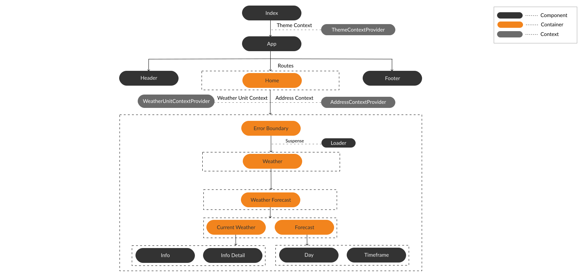
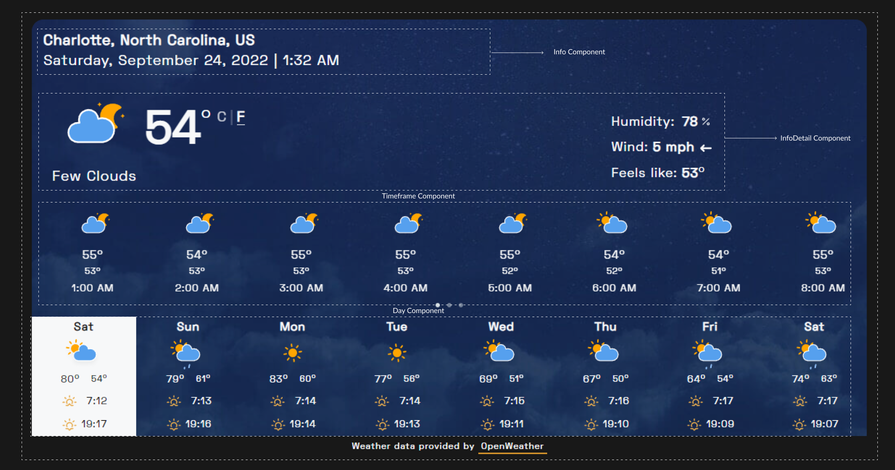

# Table of Contents

- **[Getting Started](https://github.com/iamsainikhil/weather-react#-getting-started)**

- **[What's inside?](https://github.com/iamsainikhil/weather-react#-whats-inside)**

- **[Architecture](https://github.com/iamsainikhil/weather-react#-architecture)**

- **[Learn More](https://github.com/iamsainikhil/weather-react#learn-more)**

- **[Motivation](https://github.com/iamsainikhil/weather-react#-motivation)**

- **[Technologies](https://github.com/iamsainikhil/weather-react#-technologies)**

- **[Challenges](https://github.com/iamsainikhil/weather-react#-challenges)**

- **[Roadmap](https://github.com/iamsainikhil/weather-react#-roadmap)**

- **[Contribution](https://github.com/iamsainikhil/weather-react#-contribution)**

- **[License](https://github.com/iamsainikhil/weather-react#-license)**

- **[Contact](https://github.com/iamsainikhil/weather-react#-contact)**

- **[Featured](https://github.com/iamsainikhil/weather-react#-featured-on)**

- **[Acknowledgements](https://github.com/iamsainikhil/weather-react#-acknowledgements)**

# 🚀 Getting Started

> **Note**: Dark Sky had been bought by Apple and is no longer accepting new signups. For more information, read this news **[here](https://blog.darksky.net/)**.

**When you have a Dark Sky Account, follow the instructions described in-detail **[here](https://www.notion.so/reactweather/Weather-React-Local-Setup-Branch-561fe5fa6cc546f588b93390de63ce21)** or below to set up the project locally on your machine.**

## Basic Setup

- Clone the `local-setup` branch in the repository

```bash

git clone -b local-setup https://github.com/iamsainikhil/weather-react.git

```

- Install the packages using the command `npm install`

## **Environment File**

- Create a `.env` file in the root directory of the project. Add the following properties in it:

  ```bash

  REACT_APP_DARKSKY_API_KEY=<your Dark Sky API Key>

  REACT_APP_ALGOLIA_PLACES_APP_ID=<your Algolia Places APP ID> (Optional)

  REACT_APP_ALGOLIA_PLACES_API_KEY=<your Algolia Places Search-Only API Key> (Optional)

  ```

  _You can obtain your Algolia Places API key **[here](https://community.algolia.com/places/pricing.html)**. You will get higher rate limits if you sign up and provide an api key OR it's just limited to **1000** requests/day! Moreover, code logic handles the scenario where no Algolia App ID & API key are provided since these are optional.\*_

_That's it! You can run the below available scripts to get up and running on the localhost. If you want to dive deeper into the codebase, I recommend you to check the architecture documentation to customize this application as your wish._

> _These instructions are very important to avoid the **Blank Page** issue when running the application on `http://localhost:3000`._

## Available Scripts

In the project directory, you can run:

`npm run start`

Runs the app in the development mode.Open `[http://localhost:3000](http://localhost:3000/)` to view it in the browser. The page will reload if you make edits. You will also see any lint errors in the console.

`npm test`

Launches the test runner in the interactive watch mode. See the section about

[**running tests**](https://facebook.github.io/create-react-app/docs/running-tests) for more information.

`npm run build`

Builds the app for production to the `build` folder. It correctly bundles React in production mode and optimizes the build for the best performance.

The build is minified and the filenames include the hashes. Your app is ready to be deployed!

See the section about [**deployment**](https://facebook.github.io/create-react-app/docs/deployment) for more information.

`npm run eject`

**Note**: _this is a one-way operation. Once you eject, you can’t go back!_

If you aren’t satisfied with the build tool and configuration choices, you can `eject` at any time. This command will remove the single build dependency from your project.

Instead, it will copy all the configuration files and the transitive dependencies (Webpack, Babel, ESLint, etc) right into your project so you have full control over them. All of the commands except `eject` will still work, but they will point to the copied scripts so you can tweak them. At this point you’re on your own.

You don’t have to ever use `eject`. The curated feature set is suitable for small and middle deployments, and you shouldn’t feel obligated to use this feature. However, we understand that this tool wouldn’t be useful if you couldn’t customize it when you are ready for it.

## 🧐 What's inside?

A quick look at the top-level files and directories in this weather-react project.

```
├── api
	├── address.js
	├── places.js
	├── forecast.js
	├── hello.js
├── public
├── src
	├── components
	├──	containers
	├── context
	├── fonts
	├── sass
	├── styles
	├── tests
	├── utils
	├── App.js
	├── index.js
	├── serviceWorker.js
├── tailwind.config.js
```

1.  **`api`**: This directory contain all of the code related to the back-end of the application.
    - **`<name>.js`**: This file serve as the serverless function which when deployed on Vercel will accept requests from the front-end application and return response.
2.  **`public`**: This directory contain all the assets like images, icons, manifest (PWA), and favicons.
3.  **`src`**: This directory contain all of the code related to what you see on the front-end of the application. `src` is a convention for “source code”.
    - **`components`**: This directory contain several React components with each component having an own directory.
    - **`containers`**: This directory contain several containers with each container wrapping many components defined in the above `components` directory. Each container have an own directory.
    - **`context`**: This directory contain context files with each file holding the logic related to the state shared between the containers & components.
    - **`fonts`**: This directory contain font files related to several font variations and formats.
    - **`sass`**: This directory contain the application styles written in `scss` grouped into several directories.
    - **`styles`**: This directory contain only two files `main.css` (styles used in development) and `style.css` (styles used in production).
    - **`tests`**: This directory contain test suites with each file containing several test cases testing a utility function or a component.
    - **`utils`**: This directory contain files with each file representing a utility function.
    - **`App.js`**: This is the main React component that is rendered in the DOM which contain the containers & components as well as routing.
    - **`index.js`**: This is the first file which gets run in the browser after starting the application. `App.js` component rendering as well as `serviceworker` registration process takes place in this file.
    - **`serviceWorker`**: This file contains the code related to registration/deregistration of a Service worker.
4.  **`tailwind.config.js`**: This file contains the configuration related to `tailwindcss`.

## 📖 Architecture





## **Learn More**

You can learn more in the [**Create React App documentation**](https://facebook.github.io/create-react-app/docs/getting-started).

To learn React, check out the [**React documentation**](https://reactjs.org/).

### **_Code Splitting_**

For more info, check here: [**https://facebook.github.io/create-react-app/docs/code-splitting**](https://facebook.github.io/create-react-app/docs/code-splitting)

### **_Analyzing the Bundle Size_**

For more info, check here: **[https://facebook.github.io/create-react-app/docs/analyzing-the-bundle-size](https://facebook.github.io/create-react-app/docs/analyzing-the-bundle-size)**

### **_Making a Progressive Web App_**

For more info, check here: [**https://facebook.github.io/create-react-app/docs/making-a-progressive-web-app**](https://facebook.github.io/create-react-app/docs/making-a-progressive-web-app)

### **_Advanced Configuration_**

For more info, check here: [**https://facebook.github.io/create-react-app/docs/advanced-configuration**](https://facebook.github.io/create-react-app/docs/advanced-configuration)

### **_Deployment_**

For more info, check here: **[https://facebook.github.io/create-react-app/docs/deployment](https://facebook.github.io/create-react-app/docs/deployment)**

### **`npm run build` _fails to minify_**

For more info, check here: [**https://facebook.github.io/create-react-app/docs/troubleshooting#npm-run-build-fails-to-minify**](https://facebook.github.io/create-react-app/docs/troubleshooting#npm-run-build-fails-to-minify)

## 💡 Motivation

I started learning React in February 2020 and thought of putting knowledge into reality by developing an application. I am interested in building an application that is API resource-intensive to challenge me writing efficient code keeping performance, UX, maintainability, scalability, and optimization in mind.

There are so many weather-related applications out in the wild. So, the goal is to create a UI that is beautiful yet simple and effective for any user to use.

## 💻 Technologies

- This application is created with **[Create React App](https://create-react-app.dev/)**

- **[React](https://reactjs.org/)** _(v16.12)_

- Styling syntax was written in SCSS and using **[TailwindCSS](https://tailwindcss.com/)**

- There are bunch of scripts that run when you start application to compile `scss` to `css`

## 😢 Challenges

- First, I used the OpenWeatherMap API to fetch the weather forecast data. However, 5-day forecast data was not reliable i.e. _when a user on 14th March 2020 at 7:00 PM EST tries to fetch 5-day forecast data, will get forecast data starting 15th March 2020 at 12:00 AM UTC._ This posed a big problem of categorizing 5-day data into individual days since the data is not always consistent and is based on UTC and not based on the user timezone. Finally, I switched to Dark Sky API which is more reliable and provides a robust data model. However, there is a limit of `1000` calls/day.

- Dark Sky API needs a proxy server to send and receive a response which was easy in the development stage using a browser extension like **[this](https://chrome.google.com/webstore/detail/moesif-orign-cors-changer/digfbfaphojjndkpccljibejjbppifbc)** to enable CORS in the browser. However, I can't ask every user to install this extension in their browser to check the weather forecast. So, I overcome this issue temporarily for now using the `cors-anywhere` library which you can get more info by checking **[here](https://github.com/Rob--W/cors-anywhere)**. However, I overcome the temporary solution and built a proxy server by deploying the _Node.js_ API functions on the **Vercel**'s serverless architecture and can be accessed **[here](https://weather-react-iamsainikhil.vercel.app/api/hello)**.

- Latest challenge I encountered is that **Teleport** API is temporarily shutdown and this led to broken autocomplete city search, and photos for favorited cities. Moreover, there is a tight coupling of code logic with this API. Now, I made a well thought highly scalable solution of using **Algolia Places** Rest API for fetching address based on city query as well as fetching city name based on latitude and longitude. I am very much happy about this change since it removed a lot of bad code and improved the application load times and performance.

  _Note: The application UI/UX is not affected with this API change._

## 🏎 Roadmap

- [x] Build a proxy server using Express for Dark Sky API requests

- [ ] Unit Testing

- [ ] Add documentation for components using **Storybook**

- [ ] Publish this project as an NPM package that can be consumed elsewhere.

## 🙌 Contribution

- Open pull request with improvements.

- If you have any new idea, check the **[feature request](https://github.com/iamsainikhil/weather-react/blob/master/.github/ISSUE_TEMPLATE/feature_request.md)** template to create a request.

- If you found any issue or a bug, check the **[bug report](https://github.com/iamsainikhil/weather-react/blob/master/.github/ISSUE_TEMPLATE/bug_report.md)** template to create a report.

## 📃 License

Have a look at the **[license file](https://github.com/iamsainikhil/weather-react/blob/master/LICENSE)** for details

## 📧 Contact

Whether you’d like to discuss a project, ask me about my website or simply say “hello”, I’d love to hear from you.

Email: **[contact@iamsainikhil.com](mailto:contact@iamsainikhil.com)**

## 😍 Featured On

- **[React.js Examples](https://reactjsexample.com/a-nice-weather-app-built-using-react/)**

- **[Morioh](https://morioh.com/p/fc5f51d76847)**

## 🙏 Acknowledgements

See the **[Acknowledgements](https://github.com/iamsainikhil/weather-react/wiki/Acknowledgements)** page on the wiki for a list of Acknowledgements for Weather React codebase.
